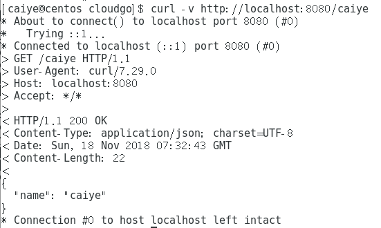
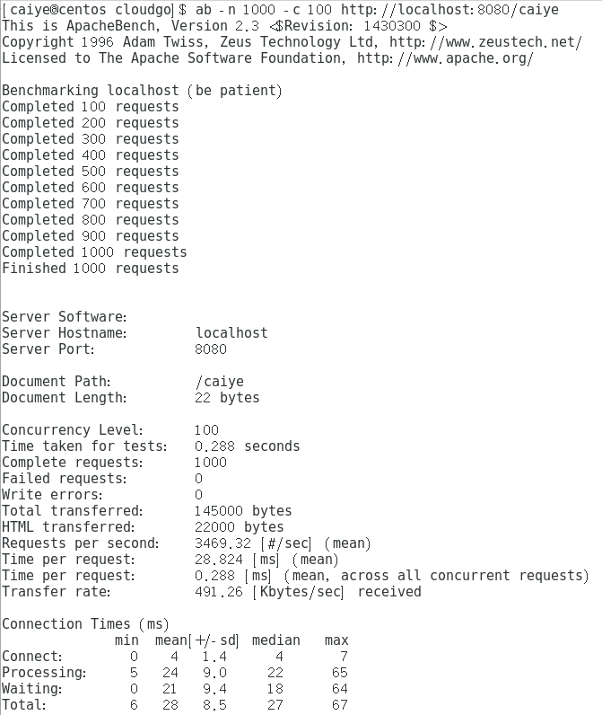
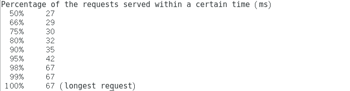
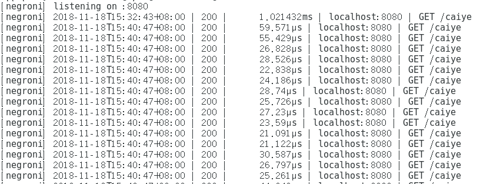

#### 简单 web 服务程序 cloudgo

1. ##### 监听端口：8080

2. ##### 模板介绍

   1. negroni ：`Negroni` 是 Go语言中一个很常用的 Web 中间件。它是一个具备微型、非嵌入式、鼓励使用原生 `net/http` 库特征的中间件。它实现了 `http.Handle` 接口，兼容 `http.Handle`。
   2. mux ：`gorilla/mux` 是一个请求路由器、调度程序，用于将传入请求与其各自的处理程序进行匹配。它小巧但稳定高效，不仅可以支持正则路由，还可以按照 `Methos、header、host` 等信息进行匹配，从设定的路由表达式中提取出参数方便上层应用，而且完全兼容 `http.ServerMux`。
   3. render ：`Render` 主要用于模板的渲染，是一个提供呈现 JSON、XML、文本、二进制数据和 HTML 模板功能的包。

3. ##### curl测试

   启动程序，`go run main.go`

   打开另一个终端窗口，输入命令：`curl -v http://localhost:8080/caiye`

   结果如下：

   

   正确获取并返回输入的 name：caiye，测试成功

   

4. ##### 压力测试 ab

   输入命令：`ab -n 1000 -c 100 http://localhost:8080/caiye`

   结果如下：

   

   

   可以看到，0 失败请求，0 输出错误，总共用时 0.288 秒，平均每个请求耗时 28.824 ms，吞吐率为每秒 3469.32 个请求.

   

   同时可以看到，运行监听程序的终端窗口，有如下信息（仅截出部分）：

   

   

5. ##### 压力测试参数解释

   `-n 1000` ，`Complete requests：1000 `表示总请求数为1000

   `-c 100` ，`Concurrency Level：100` 表示并发个数为100

   `http://localhost:8080/caiye` 表示这些请求的目标 URL

   `Time taken for tests：0.288 seconds ` 表示总请求时间

   `Requests per second: 3469.32 [#/sec] (mean)`  表示平均每秒的请求数，即吞吐率

   `Time per request: 28.824 [ms] (mean)` 表示平均每个请求消耗的时间，即用户平均请求等待时间

   `Time per request: 0.288 [ms] (mean, across all concurrent requests)` 表示服务器平均请求等待时间

   `Transfer rate: 491.26 [Kbytes/sec] received` 表示传输速率

   `Document Length: 22 bytes` 表示文档返回的长度，不包括响应头

   其中，对压力测试的结果，重点关注**吞吐率（Requests per second）、用户平均请求等待时间（Time per request）**这两个指标。

   1. 吞吐率是基于并发用户数的，即吞吐率和并发用户数相关，不同的并发用户数下，吞吐率一般是不同的。且这个数值表示当前机器的整体性能，值越大越好。
   2. 吞吐率计算公式：总请求数 / 处理完成所有请求数所花费的时间
   3. 用户平均请求等待时间计算公式：处理完成所有请求数所花费的时间 / （总请求数/并发用户数）
   4. 服务器平均请求等待时间计算公式：处理完成所有请求数所花费的时间 /  总请求数。可以看到，它是吞吐率的倒数。